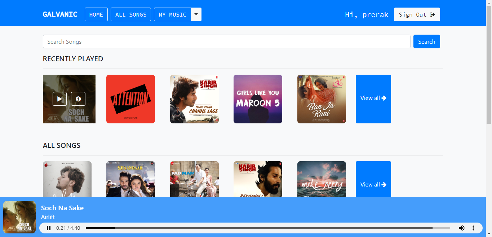
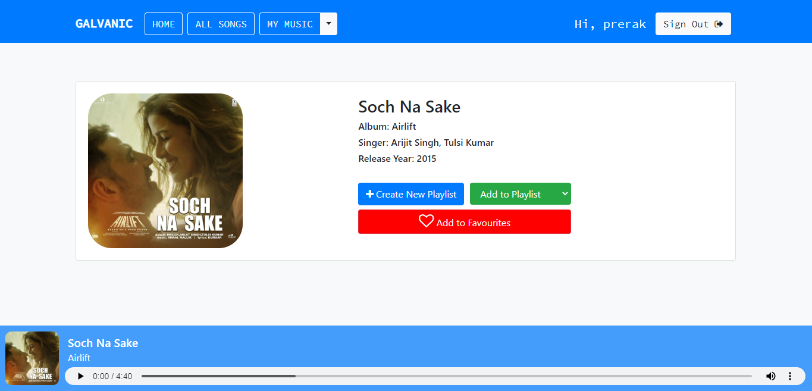

# Django based music streaming website
<<<<<<< HEAD
=======


>>>>>>> afbdc35e89a2d846105cebce6c25184e9a0ea86d

### Website Preview
#### Home Page


#### Detail Page


----

## Installation 📦

>pip install -r requirements.txt

#### Clone

- Clone this repo to your local machine.

#### Run server locally

```shell
$ python manage.py runserver
```
> Go to localhost:8000

---

## Features 📋
⚡️ SignUp and SignIn option.\
⚡️ Google SignUp and SignIn option.\
⚡️ Play song, view detailed information of song.\
⚡️ Search songs.\
⚡️ Filter songs based on language and singer.\
⚡️ Create new playlist.\
⚡️ Add/Remove songs to/from playlist.\
⚡️ Add/Remove songs to/from favourites.\
⚡️ Scroll through recently played/viewed songs.\
⚡️ Explore songs through your personalized playlist and favourites.


---


<<<<<<< HEAD
=======


>>>>>>> afbdc35e89a2d846105cebce6c25184e9a0ea86d
